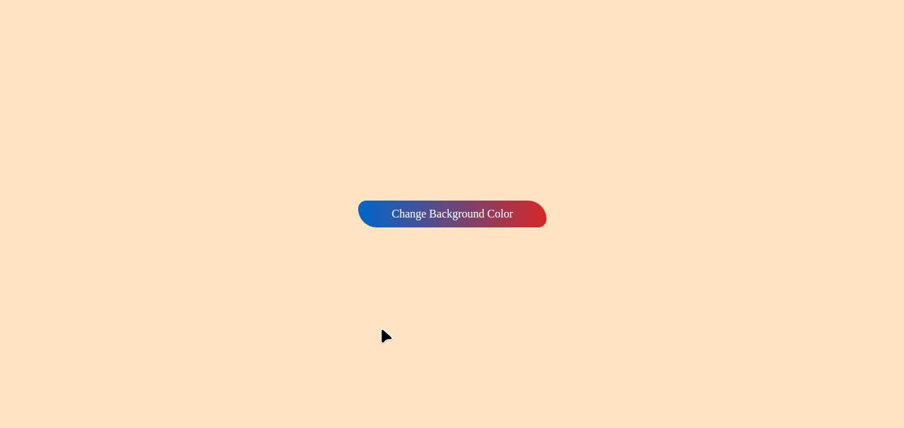

<h1 style="color:red;text-align:center;"> Change Random Background Color App</h1>

## Expected

- Creating a button in the middle of the page and defining an event for this button.
- Changing the background color <b>random</b> each time the user clicks the button.

### Bonus

- Displaying the information of the color formed in each color change on the screen.
